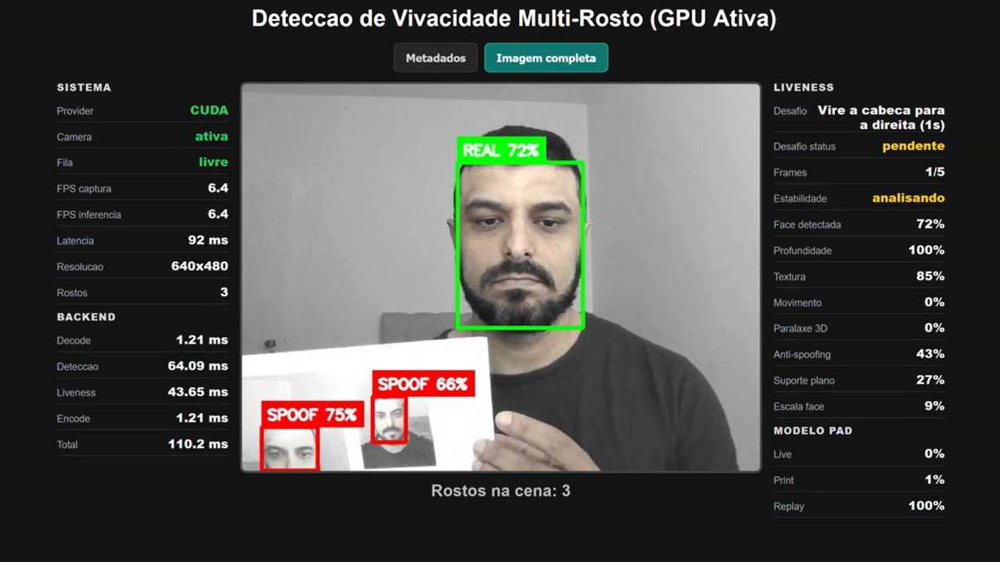

# Liveness Detection em Tempo Real

Aplicacao para deteccao de vivacidade facial usando webcam, FastAPI, OpenCV,
InsightFace, ONNXRuntime GPU e Docker com CUDA.

O sistema detecta multiplos rostos no frame e classifica cada um como `REAL` ou
`SPOOF`. A decisao de liveness nao usa apenas a deteccao facial: tambem considera
modelo anti-spoofing, profundidade, textura, cor, movimento e historico temporal
da face.



## Stack

- Python 3.10
- FastAPI + Uvicorn
- OpenCV
- InsightFace
- ONNXRuntime GPU
- MiniFASNet V2 ONNX
- Docker + NVIDIA CUDA/cuDNN

## Estrutura

```text
liveness-stream/
|-- app.py
|-- dockerfile
|-- requirements.txt
|-- readme.md
`-- liveness_app/
    |-- main.py
    |-- config.py
    |-- models.py
    |-- core/
    |   |-- evidence.py
    |   |-- temporal.py
    |   |-- challenge.py
    |   |-- calibration.py
    |   `-- utils.py
    `-- web/
        `-- index.html
```

## Como executar

No PowerShell, dentro da pasta do projeto:

```powershell
docker rm -f ia-liveness-api-gpu 2>$null
docker build -t ia-liveness-api .
docker run -d --rm --gpus device=0 -p 8080:8000 --name ia-liveness-api-gpu ia-liveness-api
```

Acesse:

```text
http://localhost:8080
```

## Validar GPU

```powershell
docker exec ia-liveness-api-gpu nvidia-smi
curl.exe http://localhost:8080/health
```

O `/health` deve indicar:

```json
{
  "gpu_enabled": true,
  "provider_ativo": "CUDA",
  "pad_model_loaded": true,
  "pad_model_provider": "CUDAExecutionProvider"
}
```

Se aparecer apenas `CPUExecutionProvider`, a inferencia nao esta usando a GPU.

## Modelo anti-spoofing

Durante o build, o Docker baixa o modelo:

```text
https://huggingface.co/garciafido/minifasnet-v2-anti-spoofing-onnx
```

## Endpoints

```text
GET  /
GET  /health
GET  /calibration?limit=20
POST /predict?modo=metadata
POST /predict?modo=imagem
```

Modos do `/predict`:

- `metadata`: retorna coordenadas, labels e scores. O navegador desenha as caixas.
- `imagem`: retorna a imagem ja processada pelo backend.

## Ajustes uteis

Os principais parametros podem ser alterados por variaveis de ambiente:

```powershell
docker run -d --rm --gpus device=0 -p 8080:8000 `
  --name ia-liveness-api-gpu `
  -e TEMPORAL_WINDOW_SIZE=12 `
  -e TEMPORAL_MIN_FRAMES=5 `
  -e PAD_REAL_THRESHOLD=0.72 `
  -e PAD_SPOOF_THRESHOLD=0.42 `
  -e PAD_MODEL_CROP_SCALES=2.0,2.7,3.4 `
  -e CALIBRATION_LOG_ENABLED=true `
  ia-liveness-api
```

Valores mais altos para `PAD_REAL_THRESHOLD` deixam o `REAL` mais conservador.
Valores menores deixam a classificacao mais permissiva, mas podem aumentar falso
positivo.

## Calibracao

A aplicacao pode gravar um CSV com as evidencias usadas na decisao:

```text
/app/logs/liveness_calibration.csv
```

Para consultar pela API:

```text
GET /calibration?limit=20
```

Esse log ajuda a comparar casos reais, fotos impressas, telas e replays.

## Autor

Leandro Nazareth

LinkedIn: https://www.linkedin.com/in/leandrosnazareth/
